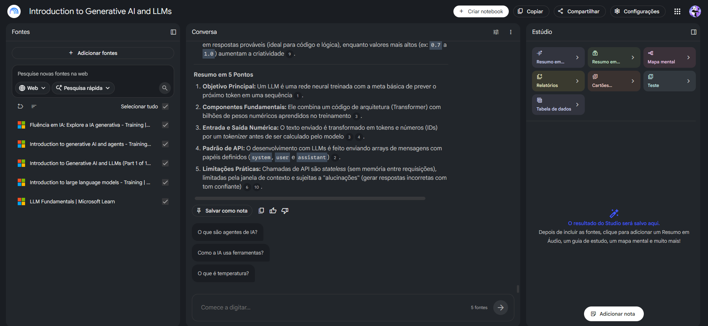
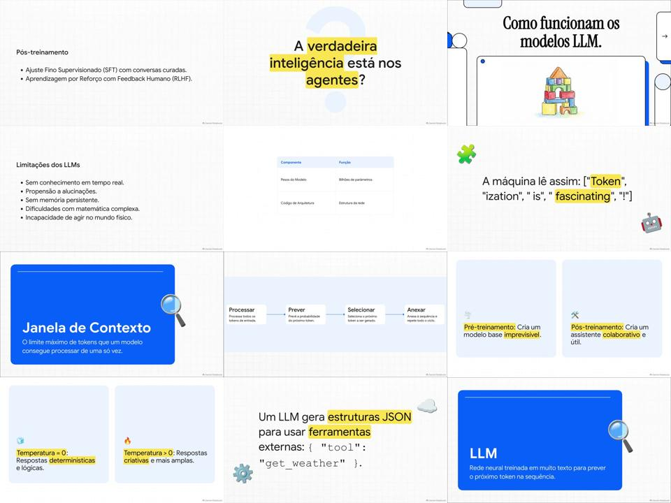

# Caderno Temático --- Fundamentos de IA Generativa e LLMs

Projeto desenvolvido para o desafio da DIO de aprendizagem ativa com IA,
utilizando o NotebookLM como ferramenta de estudo, organização de
fontes, experimentação de prompts e construção de um mini guia de
estudos.

## 1. Sobre o projeto

O objetivo deste projeto foi estudar os fundamentos de Inteligência
Artificial Generativa e Large Language Models (LLMs) a partir de fontes
abertas, fazendo perguntas ao NotebookLM e analisando as respostas
produzidas.

O trabalho reúne:

-   curadoria de 5 fontes;
-   perguntas estratégicas para estudo;
-   respostas geradas pelo NotebookLM;
-   experimentos de engenharia de prompts;
-   registro de dificuldades e respostas que não seguiram exatamente o
    pedido;
-   mini guia de estudo;
-   glossário;
-   prompts reutilizáveis.

## 2. Tema escolhido

**Fundamentos de Inteligência Artificial Generativa e Large Language
Models (LLMs).**

O tema foi escolhido por reunir conceitos importantes para quem está
começando a estudar IA, como IA generativa, LLMs, tokens, janela de
contexto, treinamento, inferência e limitações dos modelos.

## 3. Ferramenta utilizada

**NotebookLM**

O notebook utilizado no projeto recebeu o título:

> Introduction to Generative AI and LLMs

As cinco fontes foram adicionadas ao mesmo notebook e utilizadas como
base para as perguntas e respostas.



## 4. Curadoria de fontes

As cinco fontes utilizadas foram:

1.  **Fluência em IA: Explore a IA generativa --- Microsoft Learn**
    -   https://learn.microsoft.com/pt-br/training/modules/explore-generative-ai/
2.  **Introduction to generative AI and agents --- Microsoft Learn**
    -   https://learn.microsoft.com/en-us/training/modules/fundamentals-generative-ai/
3.  **Introduction to Generative AI and LLMs (Part 1 of 18) ---
    Generative AI for Beginners**
    -   https://learn.microsoft.com/en-us/shows/generative-ai-for-beginners/introduction-to-generative-ai-and-llms-generative-ai-for-beginners
4.  **Introduction to large language models --- Microsoft Learn**
    -   https://learn.microsoft.com/en-us/training/modules/introduction-large-language-models/
5.  **LLM Fundamentals --- Microsoft Learn**
    -   https://learn.microsoft.com/en-us/agent-framework/journey/llm-fundamentals

## 5. Estratégia de estudo

As perguntas foram construídas para começar pelos conceitos mais simples
e avançar gradualmente:

1.  O que é Inteligência Artificial Generativa?
2.  O que é um LLM?
3.  Qual a relação entre IA, Machine Learning, Deep Learning, IA
    Generativa e LLM?
4.  O que são tokens?
5.  O que é janela de contexto?
6.  Como um LLM aprende?
7.  Qual a diferença entre treinamento e inferência?
8.  Por que os LLMs utilizam tokens?
9.  Como melhorar um prompt?
10. Quais são as limitações dos LLMs?
11. Por que não devemos confiar automaticamente em todas as respostas?
12. Quais cuidados um iniciante deve ter?

O conjunto completo de perguntas e respostas está em
`dados/perguntas-e-respostas.txt`.

## 6. Engenharia de prompts

Um dos objetivos foi perceber que a forma de perguntar influencia a
resposta.

### Prompt mais simples

> Explique o que é um Large Language Model.

### Prompt mais estruturado

> Com base exclusivamente nas fontes deste notebook, explique o que é um
> Large Language Model (LLM). Explique primeiro de forma simples e
> depois apresente uma explicação um pouco mais técnica.

O segundo formato define a fonte de informação e a estrutura esperada da
resposta, além de indicar o nível de profundidade.

Mais exemplos estão em `prompts/prompts.md`.

## 7. "Cicatrizes" e troubleshooting

Durante o estudo foram registradas situações em que a resposta do
NotebookLM não correspondeu exatamente ao que havia sido solicitado.

### Cicatriz 1 --- resposta fora do pedido

Em uma pergunta que solicitava uma explicação sobre LLMs, a resposta
apresentada voltou a explicar tokens.

**Aprendizado:** quando a resposta sai do objetivo, vale reformular o
prompt, explicitar o assunto principal e definir a estrutura esperada.

### Cicatriz 2 --- resposta repetida

Em outra pergunta, foi solicitado que fossem apresentados cuidados para
iniciantes. A resposta voltou a apresentar limitações e confiabilidade
dos LLMs, repetindo essencialmente o conteúdo da pergunta anterior.

**Aprendizado:** prompts com tópicos numerados, formato de saída e
instruções mais específicas podem ajudar a direcionar a resposta.

Esses casos foram mantidos no projeto como parte do processo de
aprendizagem, e não escondidos.

## 8. Mini guia de estudos

### 8.1 IA Generativa

A IA generativa é apresentada nas fontes como uma tecnologia capaz de
criar novos conteúdos a partir de padrões aprendidos nos dados. Entre os
exemplos estudados estão geração de texto, geração de imagens e apoio à
criação de conteúdo.

### 8.2 Large Language Model (LLM)

Um LLM é uma rede neural treinada com grandes quantidades de dados
textuais para prever o próximo token de uma sequência.

De forma mais técnica, o material estudado apresenta elementos como
arquitetura Transformer, pesos numéricos, tokens, tokenização, janela de
contexto e geração autoregressiva.

### 8.3 Relação entre os conceitos

Uma forma simplificada apresentada durante o estudo foi:

**Inteligência Artificial → Machine Learning → Deep Learning → IA
Generativa → LLM**

Essa representação é uma simplificação didática utilizada para organizar
os conceitos.

### 8.4 Tokens

LLMs não trabalham diretamente com palavras completas. O texto é
transformado por um tokenizer em tokens, que recebem identificadores
numéricos.

Um token pode representar uma palavra, parte de uma palavra, pontuação
ou outros elementos.

### 8.5 Janela de contexto

A janela de contexto representa a quantidade de tokens que pode ser
considerada pelo modelo em uma interação.

Ela está relacionada à capacidade de manter informações relevantes, à
coerência da resposta e ao custo/latência das chamadas.

### 8.6 Treinamento e inferência

Durante o treinamento, os pesos do modelo são aprendidos/alterados.

Na inferência, o modelo utiliza os pesos já treinados para produzir uma
resposta a partir da entrada recebida.

### 8.7 Limitações

O estudo destacou limitações como:

-   janela de contexto finita;
-   chamadas de API sem memória entre requisições por padrão;
-   possibilidade de alucinações;
-   respostas não determinísticas;
-   dificuldades em matemática exata e lógica formal;
-   ausência de conhecimento em tempo real por padrão.

Por isso, respostas de LLMs não devem ser tratadas automaticamente como
verdade.

## 9. Glossário

  -----------------------------------------------------------------------
  Termo                               Definição resumida
  ----------------------------------- -----------------------------------
  IA                                  Campo relacionado à criação de
                                      sistemas capazes de realizar
                                      tarefas associadas à inteligência.

  IA Generativa                       IA capaz de gerar novos conteúdos a
                                      partir de padrões aprendidos.

  Machine Learning                    Abordagem de IA baseada em
                                      aprendizado a partir de dados.

  Deep Learning                       Abordagem baseada em redes neurais
                                      profundas.

  LLM                                 Large Language Model, modelo de
                                      linguagem treinado para prever
                                      tokens e gerar texto.

  Token                               Unidade de processamento utilizada
                                      pelo modelo de linguagem.

  Tokenizer                           Componente que transforma texto em
                                      tokens.

  Token ID                            Número usado para representar um
                                      token para o modelo.

  Transformer                         Arquitetura de rede neural
                                      utilizada em muitos LLMs.

  Pesos                               Parâmetros numéricos aprendidos
                                      durante o treinamento.

  Janela de contexto                  Quantidade de tokens que pode ser
                                      considerada em uma interação.

  Prompt                              Instrução ou entrada enviada ao
                                      modelo.

  Inferência                          Uso de um modelo treinado para
                                      gerar uma saída.

  Alucinação                          Resposta incorreta ou inventada
                                      apresentada com aparência de
                                      confiança.

  Stateless                           Situação em que uma chamada não
                                      mantém automaticamente memória
                                      entre requisições.

  Temperatura                         Parâmetro relacionado à
                                      variabilidade das respostas
                                      geradas.
  -----------------------------------------------------------------------

## 10. Prompts reutilizáveis

### Explicação para iniciante

> Com base exclusivamente nas fontes disponíveis, explique \[CONCEITO\].
> Considere que sou iniciante em tecnologia. Use linguagem simples e dê
> três exemplos práticos.

### Explicação em dois níveis

> Explique \[CONCEITO\] primeiro de forma simples e depois apresente uma
> explicação técnica, mantendo os dois níveis separados.

### Comparação

> Compare \[CONCEITO A\] e \[CONCEITO B\]. Organize a resposta em uma
> tabela com definição, finalidade, exemplo e principal diferença.

### Resumo

> Com base nas fontes do notebook, faça um resumo de \[TEMA\] em 5
> pontos. Não inclua informações que não sejam necessárias para entender
> o conceito.

### Verificação da resposta

> Responda à pergunta usando apenas as fontes disponíveis. Depois, liste
> quais pontos da resposta estão diretamente apoiados pelas fontes e
> indique se existe alguma limitação ou incerteza.

### Correção de uma resposta fora do assunto

> Minha pergunta é especificamente sobre \[TEMA\]. Ignore conteúdos
> anteriores que não respondam a esse tema. Responda em 3 partes:
> definição, funcionamento e exemplo.

## 11. Resumo em vídeo gerado no NotebookLM

Como parte da etapa de estudo, foi criado no NotebookLM um **Resumo em Vídeo** com o foco em:

> Fundamentos de IA Generativa e LLMs para iniciantes, com foco em conceitos essenciais, funcionamento, tokens, janela de contexto, treinamento, inferência e limitações.

O vídeo produzido tem aproximadamente **9 minutos e 44 segundos** e aborda conceitos como previsão do próximo token, tokenização, janela de contexto, pré-treinamento, pós-treinamento, SFT, RLHF, limitações, temperatura e uso de ferramentas externas.

A análise do vídeo está em `video/analise-do-video.md`.



## 12. Principais aprendizados

-   Organizar fontes antes de perguntar ajuda a criar um contexto de
    estudo.
-   Um prompt mais específico facilita a obtenção do formato desejado.
-   É importante conferir se a resposta realmente responde à pergunta.
-   Uma resposta aparentemente confiante pode conter erros ou não
    atender ao pedido.
-   Registrar as falhas faz parte do aprendizado de engenharia de
    prompts.
-   LLMs são ferramentas de apoio ao estudo, mas suas respostas precisam
    ser analisadas criticamente.

## 13. Estrutura do repositório

``` text
miniguia-ia-llms-notebooklm/
├── README.md
├── fontes/
│   └── fontes.md
├── prompts/
│   └── prompts.md
├── guia/
│   ├── mini-guia.md
│   └── glossario.md
├── cicatrizes/
│   └── cicatrizes.md
├── dados/
│   └── perguntas-e-respostas.txt
└── imagens/
    └── notebooklm-fontes.png
```

## 14. Observação sobre as fontes

O conteúdo conceitual do mini guia foi organizado a partir das perguntas
e respostas produzidas no NotebookLM durante este projeto. As respostas
originais foram preservadas em `dados/perguntas-e-respostas.txt`.

As "cicatrizes" também foram preservadas porque fazem parte do processo
de experimentação e mostram situações em que a resposta gerada não
correspondeu exatamente ao que havia sido solicitado.

## 15. Conclusão

O projeto mostra uma aplicação prática do NotebookLM como ferramenta de
aprendizagem ativa: primeiro foram selecionadas fontes, depois foram
elaboradas perguntas, analisadas respostas e registrados problemas
encontrados. A etapa final transforma esse material em um mini guia que
pode ser reutilizado para revisar os fundamentos de IA Generativa e
LLMs.

------------------------------------------------------------------------

**Projeto desenvolvido para o desafio da DIO --- aprendizagem ativa com
IA e construção de um repositório de estudos.**
